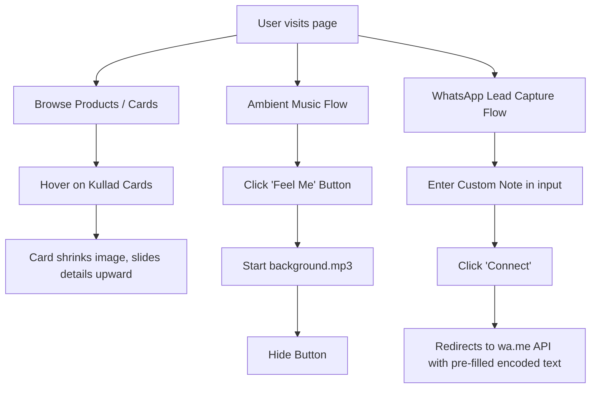

# DesiViski Chai ☕ Project Analysis Report

This document provides a comprehensive analysis of the **DesiViski Chai** Progressive Web Application (PWA). It covers the folder organization, visual design systems, layout architecture, interactive user workflows, and offline capabilities.

---

## 📂 Project Architecture & File Directory

The project is structured as a modern, lightweight, highly responsive single-page Progressive Web Application (PWA) built with pure HTML5, CSS3, and Vanilla JavaScript.

```
/kulladwithethic
├── index.html            # Main entry point and page structure
├── styles.css            # Global styling, design system, and responsive layout
├── script.js             # Client-side logic (custom sliders, audio, events)
├── sw.js                 # Service worker definition for offline asset caching
├── manifest.json         # PWA configuration for installation & styling
├── README.md             # Project overview and installation instructions
├── package-lock.json     # Node/npm lock file (tracking build dependencies)
├── Assets/               # Product showcase images and marketing banners
├── icons/                # Multi-resolution branding icons for PWA compliance
├── img/                  # SVG iconography and partner logos
└── music/                # Audio files (ambient background music)
```

---

## 🎨 Visual Design System & Aesthetics

The application features a warm, earthy, organic theme that connects Indian tea-drinking traditions with clean modern layout elements.

### 1. Typography Hierarchy
*   **Brand & Editorial Titles:** Uses `Cinzel` (via external Remix Icon resources/google fonts) with letter-spacing for a premium, heritage, and luxury feel. Used in navigation branding, section headers (`h1`), and card titles.
*   **Body & Interface Text:** Uses `Poppins` (sans-serif) for clean readability, modern structure, and navigation link text.
*   **Subheadings & Descriptions:** Uses `Gilroy-Regular` for high-quality, high-legibility descriptive paragraph text.

### 2. Curated Color Palette
*   **Primary Background:** `#feffea` (Soft clay/warm cream). This neutral, low-contrast tone acts as a warm paper backdrop and avoids the starkness of standard white.
*   **Accent Color:** `#787d62` (Olive/sage green). Represents organic cultivation, sustainability, and tea leaves. Used on buttons, border highlights, dot details, and PWA themes.
*   **Neutral Text (Dark):** `#0d0d0d` / `#000` (Pitch black / soft black). Used to establish solid hierarchy on headings and navigation elements.
*   **Neutral Text (Medium):** `#585252` (Muted warm grey). Lowers contrast for descriptions, quotes, and long paragraphs to improve readability.
*   **Accent Backgrounds:** `#fff` (Pure white). Used in cards and fields to stand out from the soft clay page background.

---

## 📐 Layout & Structural Sections

The layout utilizes vertical stacking of specialized modules designed to transition smoothly on scrolls.

### 🖥️ 1. Navigation Header (`.nav`)
*   **Layout:** Single-row flex container distributing the logo (`Viski Chai☕️`) on the left and navigation link items on the right.
*   **Workflow:** Incorporates quick link points (Home, About Us, Shop, Blog) and a direct WhatsApp integration link to chat with the business owner.

### 🫖 2. Hero Showcase (`.hero`)
*   **Layout:** Rounded banner container with a high-quality background image (`banner1.jpeg`) containment aligned to the right. Text content is left-aligned to overlap the space.
*   **Design Details:** Prominently displays the slogan *"Mitti Ki Mithas !"* paired with an ambient audio trigger button (`#play-audio` / "Feel Me❤️‍🩹").

### 🚚 3. Core Features Grid (`.row`)
*   **Layout:** Equal-width row containing four horizontal columns showing highlights: Quick Delivery, Store Pickup, Best Quality, and Recycled Packaging.
*   **Design Details:** Employs thin olive-green circular borders surrounding clean SVG icons, paired with large uppercase editorial text.

### 🏺 4. About Us Canvas (`.about`)
*   **Layout:** Split-screen layout. Left side renders a featured image (`banner2.jpg`) with a sharp `clip-path` polygon mask; right side hosts the brand value story and a call-to-action button.

### 🎠 5. Featured Slider (`.featured`)
*   **Layout:** Centered container containing a custom horizontal grid of 10 products (`pro1.jpeg` - `pro12.jpeg`).
*   **Design Details:** Includes interactive left and right scroll buttons and a drag-active customized scrollbar track underneath the slider.

### 💬 6. Testimonials Canvas (`.testimonials`)
*   **Layout:** Centered blockquote containing a quote icon and three key value propositions (clay quality, detaling tools, and pottery wheels), styled with subtle font weights.

### 🍵 7. Product Catalog Cards (`.card-container`)
*   **Layout:** Responsive flex-wrap container grouping cards into three distinct categories:
    1.  **Chai Kullad** (100ml / 80ml)
    2.  **Lassi Kullad** (250ml / 120ml)
    3.  **Milk Kullad** (180ml / 200ml)
*   **Hover Animation (Visual Detail):** 
    *   On mouse-hover, the card image height shrinks from `100%` to `50%` with a `scale(1.1)` scale zoom effect.
    *   Simultaneously, a clean white panel (`.card-details`) slides upwards from the bottom using a 3D translation (`translateY(0)`) and transitions from invisible (`opacity: 0`) to fully opaque, displaying description bullets, sizes, and pricing information.

### 💬 8. Lead Capture Form (`.subscribe`)
*   **Layout:** Stacked column featuring a text entry field for custom Kullad notes and a large black button ("Connect") that changes to olive green on hover.

### 🏺 9. Trending Products (`.tranding`)
*   **Layout:** A horizontally scrollable row containing 6 trending Kullad variants ranging from 70ml to 250ml. Incorporates hover scaling effects.

### 📰 10. Articles Showcase (`.articals`)
*   **Layout:** Three-column layout displaying blog cards with preview thumbnails, titles, and brief summaries.

### 🤝 11. Partners and Footer (`.companies` & `.footer`)
*   **Layout:** Features partner logos with black-and-white to color transition hovers, leading to a four-column site directory footer showing detailed contact information, quick links, and social links.

---

## ⚡ Interaction & Functional Workflows



### 1. Lead Generation & Contact Workflow
*   **Trigger:** User wants custom branding or wants to order.
*   **Process:** 
    1.  User enters text in `#whatsappMessage` input.
    2.  User clicks the `.subscribe-btn`.
    3.  `sendWhatsAppMessage()` JavaScript function pulls the value, encodes it using `encodeURIComponent()`, formats the WhatsApp API URL targeting phone number `7877816484`, and opens it in a new browser tab (`_blank`).

### 2. Custom Product Slider & Scrollbar
*   **File:** [script.js](file:///Users/naitik/Project/kulladwithethic/script.js)
*   **Mechanics:**
    *   Calculates `maxScrollLeft` bounds dynamically.
    *   Attaches draggable events to `scrollbar-thumb`. Captures coordinate differences (`deltaX`) and updates both the scrollbar position and the product viewport simultaneously.
    *   Hides left/right navigation arrows when the user hits scroll limits.

### 3. Ambient Sensory Music
*   **File:** [index.html](file:///Users/naitik/Project/kulladwithethic/index.html#L382-L385)
*   **Mechanics:**
    *   An `<audio>` element with `id="background-music"` holds the target track `background.mp3`.
    *   Due to modern browser autoplay security policies, the track starts muted/paused until the user interacts with the page via the "Feel Me❤️‍🩹" button, which plays the track and cleanly fades/hides the button.

---

## 📱 PWA & Mobile Performance Details

### 1. Offline Caching Strategy
*   **File:** [sw.js](file:///Users/naitik/Project/kulladwithethic/sw.js)
*   **Strategy:** Cache First with network fallback.
    *   During installation, the service worker caches critical resources: `/`, `/index.html`, `/styles.css`, `/script.js`, `/manifest.json`, and all PWA launcher icons.
    *   Subsequent fetch requests verify the cache first. If a match is found, it is served immediately (allowing full offline load). If not found, it fetches over the network, clones the response, and populates the cache for future requests.

### 2. Standalone Experience Configuration
*   **File:** [manifest.json](file:///Users/naitik/Project/kulladwithethic/manifest.json)
*   **Details:** Configures the web app as installable with a `display: "standalone"` status, matching theme color `#787d62`, and light background `#feffea` to match the in-app aesthetics when launched directly from a mobile homescreen.

### 3. Mobile Responsiveness Layout
*   **File:** [styles.css](file:///Users/naitik/Project/kulladwithethic/styles.css#L736)
*   **Details:** Inside the `@media (max-width: 768px)` media query:
    *   Nav links are hidden, collapsing the header layout into a centered, vertically stacked brand block.
    *   Grid containers (`.row`, `.card-container`, `.tranding`, `.articals`, `.footer`) are converted to stacked layouts (`flex-direction: column` or `block`) to fit small smartphone viewports.
    *   Horizontal grids (like `.slider-wrapper`) transform into touch-swipeable scroll zones with snap alignments.


## 📦 Installation & Setup  
1. **Clone the repository**  
   ```bash
   git clone https://github.com/naitikhoriya1/desiviski-chai.git
   cd desiviski-chai


 ## 📜 License
This project is open-source and available under the MIT License.

## 🤝 Contributing
Contributions are welcome! If you'd like to enhance the project, feel free to fork the repository and submit a pull request.

## 💬 Contact
📩 Email: ethicalkhoriya@gmail.com
🌐 Website: Desiviski Chai
🐙 GitHub: naitikhoriya1


